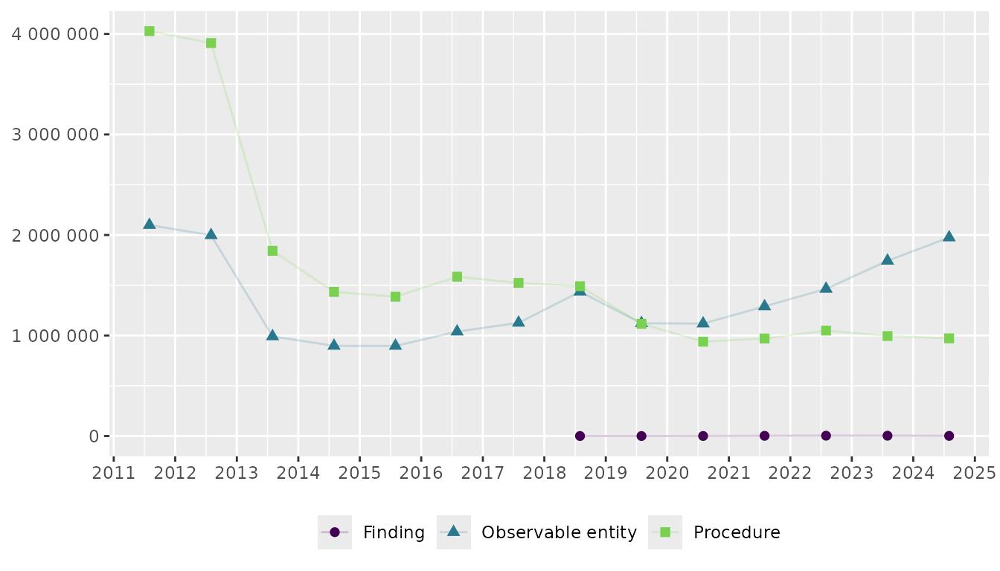

# How to extract semantic tags from SNOMED CT descriptions

SNOMED CT descriptions include semantic tags in parentheses that
classify concepts into categories such as (procedure), (finding),
(observable entity), or (disorder). Understanding these tags helps
researchers interpret what types of clinical activities their codelists
capture. For example, a depression screening codelist might include
procedures (the act of screening), observable entities (measurable
scores), and findings (clinical conclusions).

## Worked example

In this example we’re looking at the [Depression screening codes
(`DEPSCRN_COD`)](https://www.opencodelists.org/codelist/nhsd-primary-care-domain-refsets/depscrn_cod/20250627/)
from the [NHS Primary Care Domain Reference Set
Portal](https://digital.nhs.uk/data-and-information/data-collections-and-data-sets/data-collections/quality-and-outcomes-framework-qof/quality-and-outcome-framework-qof-business-rules/primary-care-domain-reference-set-portal):

### Setup

``` r

# Load packages
library(opencodecounts)
library(dplyr)
library(stringr)
library(ggplot2)
library(scales)
library(gt)
```

``` r

# Load code extract semantic tag
depscrn_cod <- get_codelist(
  "https://www.opencodelists.org/codelist/nhsd-primary-care-domain-refsets/depscrn_cod/20250627/"
)

# Get data for both codelists and extract semantic tag
depscrn_cod_usage <- get_snomed_usage() |>
  filter(snomed_code %in% c(depscrn_cod$code)) |>
  mutate(
    semantic_tag = extract_semantic_tag(description),
    semantic_tag = str_to_sentence(semantic_tag),
    description_short = strip_semantic_tag(description),
  )
```

### Table with most used codes

``` r

# Calculate sum by code for entire time period
df_tab_top10_depscrn_cod <- depscrn_cod_usage |>
  group_by(snomed_code, description_short, semantic_tag) |>
  summarise(total_usage = sum(usage), .groups = 'drop') |>
  mutate(ratio_usage = total_usage / sum(total_usage)) |> 
  slice_max(order_by = total_usage, n = 10)

# Create table
df_tab_top10_depscrn_cod |>
  group_by(semantic_tag) |>
  gt() |>
  cols_label(
    snomed_code = "SNOMED code",
    description_short = "Description",
    total_usage = "Usage",
    ratio_usage = "%"
  ) |>
  tab_style(
    style = cell_text(weight = "bold"),
    locations = cells_column_labels()
  ) |>
  tab_style(
    style = cell_text(font = "Courier New"),
    locations = cells_body(columns = snomed_code)
  ) |>
  cols_align(align = "left", columns = snomed_code) |>
  fmt_number(total_usage, decimals = 0) |>
  fmt_percent(ratio_usage, decimals = 2)
```

| SNOMED code | Description | Usage | % |
|----|----|----|----|
| Procedure |  |  |  |
| 200971000000100 | Depression screening using questions | 22,339,530 | 52.63% |
| 171207006 | Depression screening | 724,300 | 1.71% |
| 792491000000100 | Assessment using Whooley depression screen | 142,910 | 0.34% |
| 715252007 | Depression screening using Patient Health Questionnaire Nine Item score | 33,150 | 0.08% |
| Observable entity |  |  |  |
| 720433000 | Patient Health Questionnaire Nine Item score | 18,131,670 | 42.72% |
| 401320004 | Hospital Anxiety and Depression scale: depression score | 829,530 | 1.95% |
| 450320001 | Edinburgh postnatal depression scale score | 172,690 | 0.41% |
| 718366000 | Beck Depression Inventory II score | 44,940 | 0.11% |
| 803351000000106 | Whooley depression screen score | 11,180 | 0.03% |
| Finding |  |  |  |
| 112011000119102 | Negative screening for depression on Patient Health Questionnaire 9 | 8,630 | 0.02% |

### Figure showing trends over time by semantic tag

``` r

# Calculate yearly sum by semantic tag
df_fig_sem_tag_depscrn_cod <- depscrn_cod_usage |>
  group_by(start_date, semantic_tag) |>
  summarise(total_usage = sum(usage), .groups = 'drop')

# Create figure
df_fig_sem_tag_depscrn_cod |>
  ggplot(
    aes(
      y = total_usage,
      x = start_date,
      colour = semantic_tag,
      shape = semantic_tag
    )
  ) +
  geom_line(alpha = 0.2) +
  geom_point(size = 2) +
  labs(title = NULL, x = NULL, y = NULL, colour = NULL, shape = NULL) +
  scale_x_date(date_breaks = "1 year", labels = label_date_short()) +
  scale_y_continuous(labels = label_number(accuracy = 1), limits = c(0, NA)) +
  theme(legend.position = "bottom") +
  scale_colour_viridis_d(end = .8)
```


