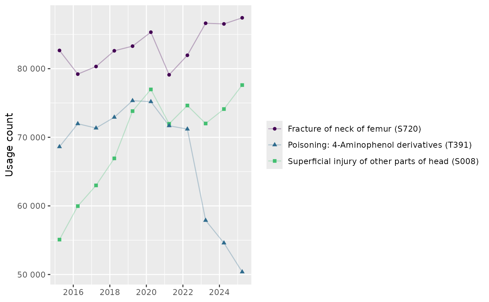

# How to use the R package

## First package installation

``` r

remotes::install_github("bennettoxford/opencodecounts")
```

## Setup

``` r

library(opencodecounts)
library(tibble)
library(dplyr)
library(ggplot2)
```

## Load codelist

``` r

# Import the codelist from OpenCodelists.org
icd10_xix_codelist <- get_codelist("https://www.opencodelists.org/codelist/opensafely/icd-10-chapter-xix/4dce479b/")

# Return the first 10 rows of the codelist
as_tibble(icd10_xix_codelist)
#> # A tibble: 1,483 × 2
#>    code    term                                                    
#>    <chr>   <chr>                                                   
#>  1 S00     Superficial injury of head                              
#>  2 S00-S09 Injuries to the head                                    
#>  3 S000    Superficial injury of scalp                             
#>  4 S001    Contusion of eyelid and periocular area                 
#>  5 S002    Other superficial injuries of eyelid and periocular area
#>  6 S003    Superficial injury of nose                              
#>  7 S004    Superficial injury of ear                               
#>  8 S005    Superficial injury of lip and oral cavity               
#>  9 S007    Multiple superficial injuries of head                   
#> 10 S008    Superficial injury of other parts of head               
#> # ℹ 1,473 more rows
```

## Filter code usage data

``` r

# Filter ICD-10 code usage to only include
#  1. codes from icd10_xix_codelist
#  2. code usage data from 2014 onwards
df_icd10_xix <- icd10_usage |>
  filter(icd10_code %in% icd10_xix_codelist$code) |>
  filter(start_date >= "2014-03-31")
```

## Calculate codes with most usage

``` r

# Select 3 most frequently used codes
top3_icd10_xix_codes <- df_icd10_xix |>
  group_by(icd10_code, description) |>
  summarise(total_usage = sum(usage)) |>
  ungroup() |>
  slice_max(total_usage, n = 3) |>
  pull(icd10_code)
#> `summarise()` has regrouped the output.
#> ℹ Summaries were computed grouped by icd10_code and description.
#> ℹ Output is grouped by icd10_code.
#> ℹ Use `summarise(.groups = "drop_last")` to silence this message.
#> ℹ Use `summarise(.by = c(icd10_code, description))` for per-operation grouping
#>   (`?dplyr::dplyr_by`) instead.
```

## Visualise trends over time

``` r

plot_top3_icd10_xix <- df_icd10_xix |>
  filter(icd10_code %in% top3_icd10_xix_codes) |>
  ggplot(aes(
    x = end_date,
    y = usage,
    colour = paste0(description, " (", icd10_code, ")"),
    shape = paste0(description, " (", icd10_code, ")"))
  ) +
  geom_line(alpha = .3) +
  geom_point() +
  scale_y_continuous(labels = scales::label_number(accuracy = 1)) +
  scale_x_date() +
  scale_colour_viridis_d(end = .7) +
  labs(
    x = NULL, y = "Usage count",
    colour = NULL, shape = NULL
  )

plot_top3_icd10_xix
```


